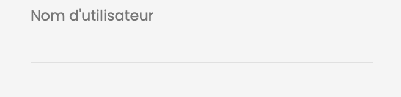

# Animated-Input

Animated-Input est une simple démonstration d'une animation pour un champ de saisie (`input`) avec un design minimaliste et épuré.

## Fonctionnalités

- Animation douce lors de la mise au point (`focus`) du champ de saisie.

## Comment l'utiliser ?

1. Clonez ce dépôt ou téléchargez les fichiers directement.
2. Ouvrez `index.html` dans votre navigateur.

## Personnalisation

Vous pouvez facilement personnaliser l'apparence et la sensation de l'animation en modifiant le fichier `styles.css`. Les principaux éléments à considérer pour une personnalisation sont:

- Couleurs
- Taille du champ de saisie
- Durée et style de l'animation

## Contribution

Si vous avez des suggestions ou des améliorations, n'hésitez pas à ouvrir une issue ou à soumettre une pull request. Toutes les contributions sont les bienvenues!